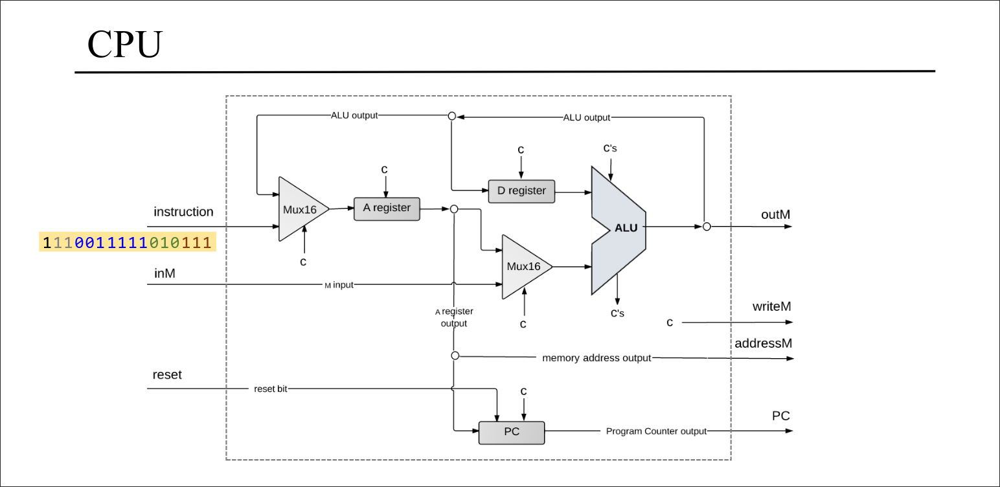
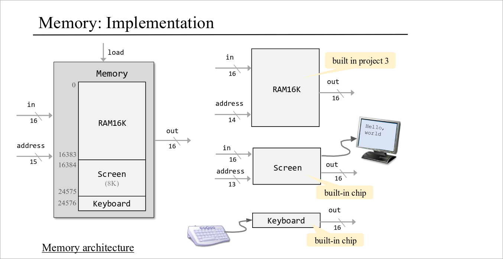

# Project 5: Computer Architecture - Building the Hack Computer

## Overview

In Project 5 of the Nand to Tetris course, we culminate our journey from basic logic gates to constructing a complete, functional computer. This project integrates all the components we've built in previous projects:

- **Logic Gates** (Project 1): Basic building blocks
- **ALU (Arithmetic Logic Unit)** (Project 2): Performs arithmetic and logical operations
- **Memory** (Project 3): RAM hierarchy and registers
- **Assembler** (Project 4): Translates assembly code to machine code

The Hack Computer consists of three main components:
1. **CPU (Central Processing Unit)**: Executes instructions
2. **Memory**: Stores data and instructions
3. **ROM (Read-Only Memory)**: Holds the program to be executed

## The Hack Computer Architecture

The Hack Computer is a 16-bit von Neumann architecture machine with the following specifications:

- **Word Size**: 16 bits
- **Address Space**: 15 bits (32,768 addresses)
- **Instruction Set**: Two types - A-instructions and C-instructions
- **Memory Map**:
  - RAM: 0x0000 - 0x3FFF (16K words)
  - Screen: 0x4000 - 0x5FFF (8K words)
  - Keyboard: 0x6000 (1 word)

### Computer.hdl - The Top-Level Chip

The `Computer.hdl` file represents the complete Hack computer:

```
CHIP Computer {
    IN reset;
    PARTS:
    ROM32K(address=PC, out=instruction);
    CPU(inM=memOut, instruction=instruction, reset=reset,
        outM=outM, writeM=writeM, addressM=addressM, pc=PC);
    Memory(in=outM, load=writeM, address=addressM, out=memOut);
}
```

- **ROM32K**: Stores the program (32K instructions)
- **CPU**: Executes instructions, interfaces with memory
- **Memory**: Data memory (RAM + Screen + Keyboard)

## The CPU (Central Processing Unit) : 



The CPU is the "brain" of the computer, responsible for fetching, decoding, and executing instructions. It contains:

- **A Register**: 16-bit register for addresses/values
- **D Register**: 16-bit register for data
- **ALU**: Performs computations
- **Program Counter (PC)**: Points to next instruction

### CPU Architecture

The CPU follows a classic von Neumann cycle:

1. **Fetch**: Get instruction from ROM[PC]
2. **Decode**: Determine instruction type and operation
3. **Execute**: Perform the operation
4. **Update PC**: Point to next instruction

### Instruction Set Architecture

The Hack ISA has two instruction types:

#### A-Instructions (Address Instructions)
- Format: `0vvvvvvvvvvvvvvv` (15 bits of address/value)
- Operation: `A = vvvvvvvvvvvvvvv`
- Purpose: Load a value into the A register

#### C-Instructions (Compute Instructions)
- Format: `111accccccdddjjj`
- Fields:
  - `a`: ALU y-input selector (0=A register, 1=Memory[A])
  - `cccccc`: ALU control bits (6 bits)
  - `ddd`: Destination bits (A, D, M registers)
  - `jjj`: Jump condition bits

### ALU Operations

The ALU performs 18 different operations based on 6 control bits:

| zx | nx | zy | ny | f | no | Operation |
|----|----|----|----|---|----|-----------|
| 1 | 0 | 1 | 0 | 1 | 0 | 0 |
| 1 | 1 | 1 | 1 | 1 | 1 | 1 |
| 1 | 1 | 1 | 0 | 1 | 0 | -1 |
| 0 | 0 | 1 | 1 | 0 | 0 | x |
| 1 | 1 | 0 | 0 | 0 | 0 | y |
| 0 | 0 | 1 | 1 | 0 | 1 | !x |
| 1 | 1 | 0 | 0 | 0 | 1 | !y |
| 0 | 0 | 1 | 1 | 1 | 1 | -x |
| 1 | 1 | 0 | 0 | 1 | 1 | -y |
| 0 | 1 | 1 | 1 | 1 | 1 | x+1 |
| 1 | 1 | 0 | 1 | 1 | 1 | y+1 |
| 0 | 0 | 1 | 1 | 1 | 0 | x-1 |
| 1 | 1 | 0 | 0 | 1 | 0 | y-1 |
| 0 | 0 | 0 | 0 | 1 | 0 | x+y |
| 0 | 1 | 0 | 0 | 1 | 1 | x-y |
| 0 | 0 | 0 | 0 | 0 | 0 | x&y |
| 0 | 0 | 0 | 0 | 0 | 1 | x|y |

### Jump Conditions

The CPU supports 7 jump conditions based on ALU output flags:

| jjj | Condition | Meaning |
|-----|-----------|---------|
| 000 | Never | No jump |
| 001 | JGT | if out > 0 |
| 010 | JEQ | if out = 0 |
| 011 | JGE | if out ≥ 0 |
| 100 | JLT | if out < 0 |
| 101 | JNE | if out ≠ 0 |
| 110 | JLE | if out ≤ 0 |
| 111 | JMP | Unconditional |

## Memory System



The Hack Computer has a unified memory address space divided into three regions:

### RAM16K (Data Memory)
- Address range: 0x0000 - 0x3FFF
- 16,384 words of read/write memory
- Built hierarchically: RAM16K → 4×RAM4K → 8×RAM512 → 8×RAM64 → 8×RAM8 → 8×Register

### Screen Memory Map
- Address range: 0x4000 - 0x5FFF
- 8,192 words (32,768 pixels)
- Each word represents 16 consecutive pixels
- Writing to screen memory updates the display

### Keyboard Memory Map
- Address: 0x6000
- Single word containing ASCII code of pressed key
- Read-only; writing has no effect

## Program Execution

### The Fetch-Execute Cycle

1. **Fetch**: `instruction = ROM[PC]`
2. **Execute**:
   - If A-instruction: `A = instruction[14..0]`
   - If C-instruction:
     - Compute: `ALUout = ALU(D, A/M, control_bits)`
     - Store results in specified destinations
     - Evaluate jump condition and update PC accordingly
3. **PC Update**: `PC = PC + 1` or jump address

### Timing Considerations

- **Combinational Outputs**: `outM`, `writeM` change immediately
- **Clocked Outputs**: `addressM`, `pc` change on next clock cycle
- Memory writes take effect on the next cycle

## Building the Computer

### Implementation Details

#### CPU Implementation (`CPU.hdl`)
- **Instruction Decoding**: Uses combinational logic to decode instruction bits
- **Register Control**: A and D registers load based on instruction type and destination bits
- **ALU Integration**: ALU output feeds back to registers and memory
- **Jump Logic**: Evaluates ALU flags against jump bits to control PC

#### Memory Implementation (`Memory.hdl`)
- **Address Decoding**: Uses `address[13..14]` to select memory region
- **DMux4Way**: Routes load signal to appropriate memory component
- **Mux4Way16**: Selects output from the addressed memory region

### Key Design Patterns

1. **Hierarchical Design**: Complex chips built from simpler ones
2. **Time-Separation**: Combinational vs. sequential logic
3. **Address Decoding**: Multiplexing/demultiplexing for memory mapping
4. **Control Signals**: Load signals control when data is stored

## Testing and Validation

The computer is tested by:
1. Loading machine code programs into ROM32K
2. Running the computer with `reset=1` then `reset=0`
3. Observing memory contents, screen output, and PC progression

### Sample Programs
- **Add.hack**: Adds two numbers
- **Max.hack**: Finds maximum of two numbers
- **Rect.hack**: Draws rectangles on screen
- **Pong.hack**: Interactive Pong game

## Significance

Project 5 represents the culmination of the Nand to Tetris journey. By building a complete computer from first principles, we've demonstrated:

- How hardware and software interact
- The von Neumann architecture in practice
- The power of abstraction and hierarchical design
- The foundation of modern computing systems

This computer, though simple, can run complex programs including operating systems, compilers, and games - proving that all software is ultimately executed by logic gates manipulating bits.

## Further Reading

- "The Elements of Computing Systems" by Nisan and Schocken
- Nand2Tetris website: www.nand2tetris.org
- Computer Organization and Design by Patterson and Hennessy